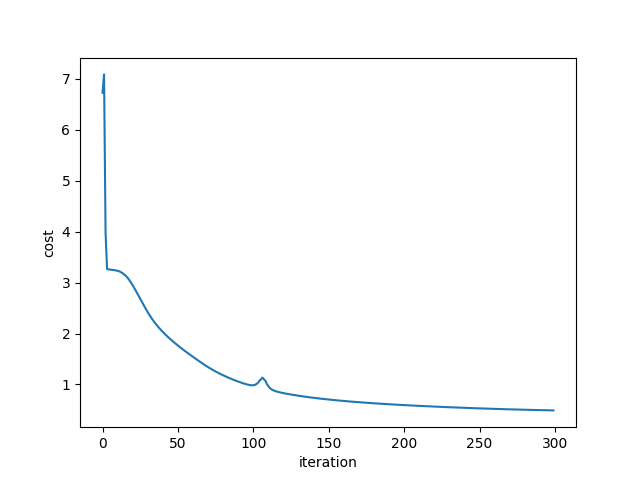

# A simple Neural Network from scratch

A simple python implementation of Neural Network from scratch without using any ML/DL libraries



## Getting Started

These instructions will get you a copy of the project up and running on your local machine for development and testing purposes.

### Prerequisites


* [Numpy](http://www.numpy.org/) - Multidimensioanl Mathematical Computing 
* [Scipy](https://docs.scipy.org/doc/) - Was used to load Mat file in Python
* [Matplotlib](https://matplotlib.org/contents.html) - Used to plot Graph
* [Pickle](https://docs.python.org/3/library/pickle.html) - Used to save trained models/object


### Installing

Clone the repository

```
git clone https://github.com/zishansami102/Neural-Network-from-Scratch-MNIST-Datset-
```
Move into the directory and then run the following command to start training the neural network

```
python main.py
```

## Contributing

Contributions are welcome of course ;)


